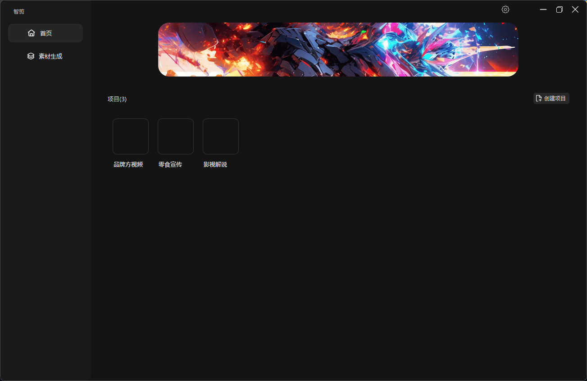

# 🎥智剪

## 💡概述

## 🎯功能特点

1. **🚀批量生成**：只需输入素材和文案，智剪即可自动批量生成视频，大大提升了视频制作的效率。

2. 🛠素材处理：智剪提供素材处理功能，可以将批量将多个完整的视频素材智能分割成多个镜头素材，并保存为独立的视频文件，用于生成大量的视频素材。

3. **🔊配音和音乐支持**：智剪支持多个配音平台，例如微软、火山（抖音）等，并支持添加背景音乐， 让您的视频能够更丰富、更能唤起观众的感官体验。

4. **📚自动生成字幕**：智剪自带字幕识别功能，能够无缝地为您的视频生成字幕。

5. **💪强大的性能**：视频生成速度按照您的电脑配置，但在大部分配置下，智剪都能在短时间内制作出200到1000个高质量的视频。

6. **🌐广泛的应用领域**：利用智剪，您能对各种类型的视频进行生成，例如带货类、门店宣传类、品牌产品推广类、广告线索获取类以及影视解说类视频等。

7. **🎨自定义设置**：智剪允许用户自定义镜头顺序或选择随机混剪模式，帮助您打造出独特的视频风格。

8. **🧩兼容多个AI平台**：智剪支持与chatGPT、文心一言、讯飞星火等多个AI平台对接，能够充分利用各平台的长处，提高您的创作效率。

借助智剪，大规模的视频制作变得更加轻松、高效。使用自有的素材库和文案，您可快速创作出大量优质视频，满足各种场景的需求。

